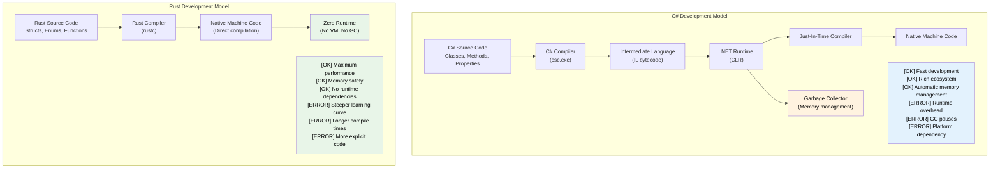

<!-- translation-status: draft -->
<!-- last-updated: 2026-06-13 -->

# 1. 引言与动机

## 讲师介绍与整体方法

- **讲师介绍**
    - Microsoft SCHIE（Silicon and Cloud Hardware Infrastructure Engineering，硅与云硬件基础架构工程）团队的首席固件架构师
    - 资深行业专家，专精安全、系统编程（固件、操作系统、虚拟机管理程序）、CPU 与平台架构，以及 C++ 系统级开发
    - 2017 年在 AWS EC2 首次接触 Rust，从此与这门语言结下不解之缘
- **本课程的设计原则：尽可能交互式**
    - 前提假设：你已经熟悉 C# 与 .NET 开发
    - 示例刻意把 C# 概念映射到 Rust 的对应物
    - **任何时候都欢迎随时提出问题**

---

## 为什么 C# 开发者应该学 Rust

> **本节目标**：讲清楚 Rust 对 C# 开发者的意义 —— 托管代码与原生代码之间的性能差距、Rust 如何在编译期消除空引用异常和"看不见"的控制流，以及 Rust 补充或替代 C# 的关键场景。
>
> **难度**：🟢 入门

### 不付"运行时税"的性能

```csharp
// C# —— 开发效率高，但有运行时开销
public class DataProcessor
{
    private List<int> data = new List<int>();
    
    public void ProcessLargeDataset()
    {
        // 分配会触发 GC
        for (int i = 0; i < 10_000_000; i++)
        {
            data.Add(i * 2); // 给 GC 施压
        }
        // 处理过程中会出现无法预测的 GC 暂停
    }
}
// 运行时：不稳定（50-200ms，取决于 GC）
// 内存：~80MB（含 GC 开销）
// 可预测性：低（GC 暂停）
```

```rust
// Rust —— 同样表达力，零运行时开销
struct DataProcessor {
    data: Vec<i32>,
}

impl DataProcessor {
    fn process_large_dataset(&mut self) {
        // 零成本抽象
        for i in 0..10_000_000 {
            self.data.push(i * 2); // 无 GC 压力
        }
        // 性能确定性
    }
}
// 运行时：稳定（~30ms）
// 内存：~40MB（精确分配）
// 可预测性：高（无 GC）
```

### 无运行时检查的内存安全

```csharp
// C# —— 运行期保障安全，但有开销
public class RuntimeCheckedOperations
{
    public string? ProcessArray(int[] array)
    {
        // 每次访问都要做运行期边界检查
        if (array.Length > 0)
        {
            return array[0].ToString(); // 安全 —— int 是值类型，永远不为 null
        }
        return null; // 可空返回（C# 8+ 的 nullable reference types）
    }
    
    public void ProcessConcurrently()
    {
        var list = new List<int>();
        
        // 可能产生数据竞争，需要谨慎加锁
        Parallel.For(0, 1000, i =>
        {
            lock (list) // 运行期开销
            {
                list.Add(i);
            }
        });
    }
}
```

```rust
// Rust —— 编译期保障安全，零运行期成本
struct SafeOperations;

impl SafeOperations {
    // 编译期空安全，无运行期检查
    fn process_array(array: &[i32]) -> Option<String> {
        array.first().map(|x| x.to_string())
        // 不可能出现空引用
        // 可证明安全时，边界检查会被优化掉
    }
    
    fn process_concurrently() {
        use std::sync::{Arc, Mutex};
        use std::thread;
        
        let data = Arc::new(Mutex::new(Vec::new()));
        
        // 数据竞争在编译期就被阻止
        let handles: Vec<_> = (0..1000).map(|i| {
            let data = Arc::clone(&data);
            thread::spawn(move || {
                data.lock().unwrap().push(i);
            })
        }).collect();
        
        for handle in handles {
            handle.join().unwrap();
        }
    }
}
```

---

## C# 的常见痛点，Rust 是怎么解决的

### 1. 价值十亿美元的错误：空引用

```csharp
// C# —— 空引用异常是运行期的"炸弹"
public class UserService
{
    public string GetUserDisplayName(User user)
    {
        // 这里任何一处都可能在运行期抛 NullReferenceException
        return user.Profile.DisplayName.ToUpper();
        //     ^^^^^ ^^^^^^^ ^^^^^^^^^^^ ^^^^^^^
        //     运行期都可能为 null
    }
    
    // 可空引用类型（C# 8+）有帮助，但 null 仍可能漏过
    public string GetDisplayName(User? user)
    {
        return user?.Profile?.DisplayName?.ToUpper() ?? "Unknown";
        // 这一行靠 ?. 和 ?? 是空安全的，
        // 但 NRT 只是"建议"，编译器可以用 `!` 强制绕过
    }
}
```

```rust
// Rust —— 空安全由编译器保证
struct UserService;

impl UserService {
    fn get_user_display_name(user: &User) -> Option<String> {
        user.profile.as_ref()?
            .display_name.as_ref()
            .map(|name| name.to_uppercase())
        // 编译器强制你处理 None 分支
        // 不可能存在空指针异常
    }
    
    fn get_display_name_safe(user: Option<&User>) -> String {
        user.and_then(|u| u.profile.as_ref())
            .and_then(|p| p.display_name.as_ref())
            .map(|name| name.to_uppercase())
            .unwrap_or_else(|| "Unknown".to_string())
        // 显式处理，没有意外
    }
}
```

### 2. 看不见的异常和控制流

```csharp
// C# —— 异常可能在任何地方抛出
public async Task<UserData> GetUserDataAsync(int userId)
{
    // 每一行都可能在运行期抛出不同异常
    var user = await userRepository.GetAsync(userId);         // SqlException
    var permissions = await permissionService.GetAsync(user); // HttpRequestException
    var preferences = await preferenceService.GetAsync(user); // TimeoutException

    return new UserData(user, permissions, preferences);
    // 调用者完全不知道该期待哪些异常
}
```

```rust
// Rust —— 错误全部显式出现在函数签名里
#[derive(Debug)]
enum UserDataError {
    DatabaseError(String),
    NetworkError(String),
    Timeout,
    UserNotFound(i32),
}

async fn get_user_data(user_id: i32) -> Result<UserData, UserDataError> {
    // 错误全部显式处理
    let user = user_repository.get(user_id).await
        .map_err(UserDataError::DatabaseError)?;

    let permissions = permission_service.get(&user).await
        .map_err(UserDataError::NetworkError)?;

    let preferences = preference_service.get(&user).await
        .map_err(|_| UserDataError::Timeout)?;

    Ok(UserData::new(user, permissions, preferences))
    // 调用者清楚地知道可能有哪些错误
}
```

### 3. 正确性：把类型系统当作"证明引擎"

Rust 的类型系统能在编译期捕获整类逻辑 bug，而 C# 只能在运行期捕获 —— 甚至捕获不到。

#### ADT（代数数据类型）vs 密封类的折中写法

```csharp
// C# —— 可辨识联合（discriminated union）需要密封类的样板代码。
// 编译器只在没有 catch-all `_` 时警告遗漏分支（CS8524）。
// 实际工程中，大多数 C# 代码用 `_` 当兜底，警告就被静音了。
public abstract record Shape;
public sealed record Circle(double Radius)   : Shape;
public sealed record Rectangle(double W, double H) : Shape;
public sealed record Triangle(double A, double B, double C) : Shape;

public static double Area(Shape shape) => shape switch
{
    Circle c    => Math.PI * c.Radius * c.Radius,
    Rectangle r => r.W * r.H,
    // 漏了 Triangle？_ catch-all 把编译器警告静音了。
    _           => throw new ArgumentException("Unknown shape")
};
// 六个月后加一个新变体 —— _ 模式把"漏掉的情况"藏起来了。
// 没有编译器警告提醒你去更新那 47 个 switch 表达式。
```

```rust
// Rust —— ADT + 穷尽匹配 = 编译期证明
enum Shape {
    Circle { radius: f64 },
    Rectangle { w: f64, h: f64 },
    Triangle { a: f64, b: f64, c: f64 },
}

fn area(shape: &Shape) -> f64 {
    match shape {
        Shape::Circle { radius }    => std::f64::consts::PI * radius * radius,
        Shape::Rectangle { w, h }   => w * h,
        // 漏了 Triangle？编译期错误：non-exhaustive pattern
        Shape::Triangle { a, b, c } => {
            let s = (a + b + c) / 2.0;
            (s * (s - a) * (s - b) * (s - c)).sqrt()
        }
    }
}
// 加一个新变体 → 编译器告诉你每一个需要更新的 match。
```

#### 默认不可变 vs 显式不可变

```csharp
// C# —— 默认全是可变的
public class Config
{
    public string Host { get; set; }   // 默认可变
    public int Port { get; set; }
}

// "readonly" 和 "record" 有帮助，但不能阻止深层修改：
public record ServerConfig(string Host, int Port, List<string> AllowedOrigins);

var config = new ServerConfig("localhost", 8080, new List<string> { "*.example.com" });
// Record 看似"不可变"，但引用类型字段并不是：
config.AllowedOrigins.Add("*.evil.com"); // 编译通过且能改！← bug
// 编译器不会给你任何警告。
```

```rust
// Rust —— 默认不可变，可变性必须显式声明
struct Config {
    host: String,
    port: u16,
    allowed_origins: Vec<String>,
}

let config = Config {
    host: "localhost".into(),
    port: 8080,
    allowed_origins: vec!["*.example.com".into()],
};

// config.allowed_origins.push("*.evil.com".into()); // 错误：cannot borrow as mutable

// 可变必须显式 opt-in：
let mut config = config;
config.allowed_origins.push("*.safe.com".into()); // OK —— 明显是可变的

// 签名里写 "mut" 就告诉所有读者："这个函数会改数据"
fn add_origin(config: &mut Config, origin: String) {
    config.allowed_origins.push(origin);
}
```

#### 函数式编程：一等公民 vs 半路出家

```csharp
// C# —— 函数式是后加的；LINQ 表达力强，但语言处处跟你作对
public IEnumerable<Order> GetHighValueOrders(IEnumerable<Order> orders)
{
    return orders
        .Where(o => o.Total > 1000)   // Func<Order, bool> —— 堆分配的委托
        .Select(o => new OrderSummary  // 匿名类型或额外类
        {
            Id = o.Id,
            Total = o.Total
        })
        .OrderByDescending(o => o.Total);
    // 没有穷尽匹配
    // 任何位置都可能有 null 潜入
    // 无法强制纯度 —— 任何 lambda 都可能有副作用
}
```

```rust
// Rust —— 函数式是一等公民
fn get_high_value_orders(orders: &[Order]) -> Vec<OrderSummary> {
    orders.iter()
        .filter(|o| o.total > 1000)        // 零成本闭包，无堆分配
        .map(|o| OrderSummary {            // 编译期类型检查的 struct
            id: o.id,
            total: o.total,
        })
        .sorted_by(|a, b| b.total.cmp(&a.total)) // itertools
        .collect()
    // 流水线里没有 null
    // 闭包被单态化 —— 相对手写循环零开销
    // 纯度强制保证：&[Order] 意味着函数不可能修改 orders
}
```

#### 继承：理论上优雅，实践中脆弱

```csharp
// C# —— 脆弱基类问题
public class Animal
{
    public virtual string Speak() => "...";
    public void Greet() => Console.WriteLine($"I say: {Speak()}");
}

public class Dog : Animal
{
    public override string Speak() => "Woof!";
}

public class RobotDog : Dog
{
    // Greet() 调的是哪个 Speak()？如果 Dog 改了怎么办？
    // 接口 + default method 还会带来菱形继承问题
    // 紧耦合：改 Animal 可能悄无声息地搞坏 RobotDog
}

// C# 项目里常见的反模式：
// - 上帝基类，20 个虚方法
// - 5+ 层深继承，没人能推理
// - "protected" 字段制造的隐藏耦合
// - 改基类悄无声息地改变派生行为
```

```rust
// Rust —— 语言强制"组合优于继承"
trait Speaker {
    fn speak(&self) -> &str;
}

trait Greeter: Speaker {
    fn greet(&self) {
        println!("I say: {}", self.speak());
    }
}

struct Dog;
impl Speaker for Dog {
    fn speak(&self) -> &str { "Woof!" }
}
impl Greeter for Dog {} // 用默认 greet()

struct RobotDog {
    voice: String, // 组合：持有自己的数据
}
impl Speaker for RobotDog {
    fn speak(&self) -> &str { &self.voice }
}
impl Greeter for RobotDog {} // 行为清晰、显式

// 没有脆弱基类问题 —— 根本没有基类
// 没有隐藏耦合 —— trait 是显式契约
// 没有菱形继承 —— trait 一致性规则杜绝歧义
// 给 Speaker 加个新方法？编译器告诉你所有要实现的地方。
```

> **核心洞察**：在 C# 里，正确性是一种"纪律" —— 你得指望开发者遵守约定、写测试、在 code review 里抓边界场景。
> 在 Rust 里，正确性是**类型系统的一项性质** —— 整类 bug（空解引用、漏掉的变体、意外的可变、数据竞争）从结构上就不可能发生。

---

### 4. GC 导致的不可预测性能

```csharp
// C# —— GC 随时可能暂停
public class HighFrequencyTrader
{
    private List<Trade> trades = new List<Trade>();
    
    public void ProcessMarketData(MarketTick tick)
    {
        // 分配可能在最糟的时机触发 GC
        var analysis = new MarketAnalysis(tick);
        trades.Add(new Trade(analysis.Signal, tick.Price));
        
        // 关键行情瞬间，GC 可能在这里暂停
        // 暂停时长：1-100ms，取决于堆大小
    }
}
```

```rust
// Rust —— 可预测、确定的性能
struct HighFrequencyTrader {
    trades: Vec<Trade>,
}

impl HighFrequencyTrader {
    fn process_market_data(&mut self, tick: MarketTick) {
        // 把 Copy 字段先取出来，再把 tick 移进 analysis
        let price = tick.price;

        // 零分配，性能可预测
        let analysis = MarketAnalysis::from(tick);
        self.trades.push(Trade::new(analysis.signal(), price));

        // 无 GC 暂停，一致的亚微秒级延迟
        // 性能由类型系统保证
    }
}
```

---

## 什么时候选 Rust 替代 C#

### ✅ 选 Rust 的场景

- **正确性至关重要**：状态机、协议实现、金融逻辑 —— 漏一个分支是生产事故而不是测试失败
- **性能关键**：实时系统、高频交易、游戏引擎
- **内存占用要紧**：嵌入式、云成本、移动应用
- **可预测性必需**：医疗设备、汽车电子、金融系统
- **安全是头等大事**：密码学、网络安全、系统级代码
- **长跑服务**：GC 暂停会带来问题
- **资源受限环境**：IoT、边缘计算
- **系统编程**：CLI 工具、数据库、Web 服务器、操作系统

### ✅ 留 C# 的场景

- **快速应用开发**：业务应用、CRUD 应用
- **既有大型代码库**：迁移成本太高
- **团队技术栈**：Rust 学习曲线不能摊平收益
- **企业集成**：重度依赖 .NET Framework / Windows
- **GUI 应用**：WPF、WinUI、Blazor 生态
- **抢时间上市**：开发速度压倒性能

### 🔄 两者都用（混合方案）

- **性能关键组件用 Rust**：通过 P/Invoke 从 C# 调用
- **业务逻辑留 C#**：熟悉、生产力高
- **渐进式迁移**：新服务先上 Rust

---

## 真实世界的影响：为什么这些公司选了 Rust

### Dropbox：存储基础设施

- **之前（Python）**：CPU 占用高、内存开销大
- **之后（Rust）**：性能提升 10 倍、内存减少 50%
- **结果**：节省数百万美元基础设施成本

### Discord：语音/视频后端

- **之前（Go）**：GC 暂停导致音频卡顿
- **之后（Rust）**：持续低延迟
- **结果**：用户体验更好，服务器成本下降

### Microsoft：Windows 组件

- **Rust 在 Windows 的应用**：文件系统、网络栈组件
- **收益**：内存安全且无性能损耗
- **影响**：安全漏洞更少，性能持平

### 对 C# 开发者意味着什么

1. **技能互补**：Rust 和 C# 解决不同问题
2. **职业成长**：系统编程经验越来越值钱
3. **理解性能**：掌握零成本抽象
4. **安全思维**：把"所有权"思想带回到任何语言
5. **云成本**：性能直接影响基础设施开销

---

## 语言哲学对比

### C# 的哲学

- **生产力优先**：工具链丰富、框架完备、"成功之坑（pit of success）"
- **托管运行时**：GC 自动管内存
- **企业向**：强类型 + 反射 + 庞大标准库
- **面向对象**：类、继承、接口作为主要抽象

### Rust 的哲学

- **不牺牲性能**：零成本抽象，无运行时开销
- **内存安全**：编译期保证，杜绝崩溃与安全漏洞
- **系统编程**：直接接触硬件，又保留高层抽象
- **函数式 + 系统级**：默认不可变，基于所有权的资源管理

下面这张图把两种开发模型的差异可视化：



> 译者注：图里 C# 走"源码 → C# 编译器 → IL → CLR（含 JIT 和 GC）→ 原生机器码"路径，Rust 则"源码 → rustc → 直接产出原生机器码"，没有 VM、没有 GC。这就是性能差距的根源。

---

## 速查表：Rust vs C#

| **概念** | **C#** | **Rust** | **关键差异** |
|---|---|---|---|
| 内存管理 | GC（垃圾回收器） | 所有权系统 | 零成本、确定性的清理 |
| 空引用 | `null` 到处都是 | `Option<T>` | 编译期空安全 |
| 错误处理 | 异常 | `Result<T, E>` | 显式、无隐藏控制流 |
| 可变性 | 默认可变 | 默认不可变 | 可变必须显式 opt-in |
| 类型系统 | 引用 / 值类型 | 所有权类型 | 移动语义、借用 |
| 程序集 | GAC、app domain（.NET Framework）；side-by-side（.NET 5+）| Crate | 静态链接，无运行时 |
| 命名空间 | `using System.IO` | `use std::fs` | 模块系统 |
| 接口 | `interface IFoo` | `trait Foo` | 支持默认实现 |
| 泛型 | `List<T>`（通过 `where` 写可选约束）| `Vec<T>`（trait bound 如 `T: Clone`）| 零成本抽象 |
| 线程 | lock、async/await | 所有权 + `Send`/`Sync` | 编译期阻止数据竞争 |
| 性能 | JIT 编译 | AOT 编译 | 可预测，无 GC 暂停 |

---